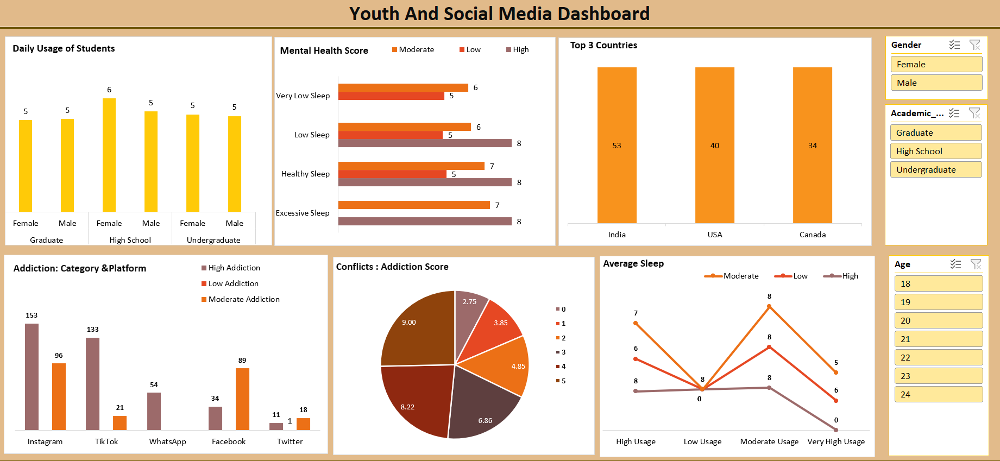

# 📊 Youth and Social Media Dashboard

This project explores the impact of social media usage on youth, focusing on key areas like addiction levels, mental health, sleep patterns, and academic background. The dashboard is built using Microsoft Excel and includes interactive filters and visualizations.

---

## 📁 Project Structure

- `Report` sheet: Interactive dashboard displaying key metrics and insights.
- Other sheets: Raw data, calculations, and charts supporting the dashboard (e.g., Mental Health Score, Addiction Category, Average Sleep, etc.)

---

## 🔍 Key Insights

- **High School Females** show the **highest daily social media usage**.
- **Instagram** is the platform with the **highest addiction** rate.
- Students with **Healthy Sleep** show the **best mental health scores**.
- **India** tops the list of survey participants.
- **High social media addiction** is strongly linked to **more interpersonal conflicts**.
- **Low usage** of social media correlates with **better sleep quality**.

---

## 🎯 Use Cases

This dashboard can be used in:
- **Educational Institutions**: To monitor student well-being.
- **Mental Health Programs**: To identify risk groups.
- **Youth Surveys & Research**: For insights into digital behavior.
- **Parental Seminars**: To educate about the effects of social media.

---

## 📌 Filters Available

- Gender
- Academic Level (Graduate, High School, Undergraduate)
- Age

---

## 📊 Tools Used

- Microsoft Excel (Pivot Tables, Charts, Slicers, Conditional Formatting)

---

## 🧠 Topics Covered

- Social Media Addiction by Platform
- Mental Health vs. Sleep Patterns
- Country-wise Participation
- Conflicts due to Social Media Usage
- Sleep Pattern Analysis

---

## 📷 Dashboard Preview

> *(Make sure to add your actual screenshot file in the repository)*

---

## 📥 How to Use

1. Clone the repo or download the `.xlsx` file.
2. Open it in Microsoft Excel.
3. Explore insights using available slicers.

---

## 📧 Contact

Feel free to reach out for feedback or collaborations!  
**Author**: Kajal Kewat  
**Email**: [your-email@example.com]

---

## ⭐️ Star this repo if you found it insightful!
